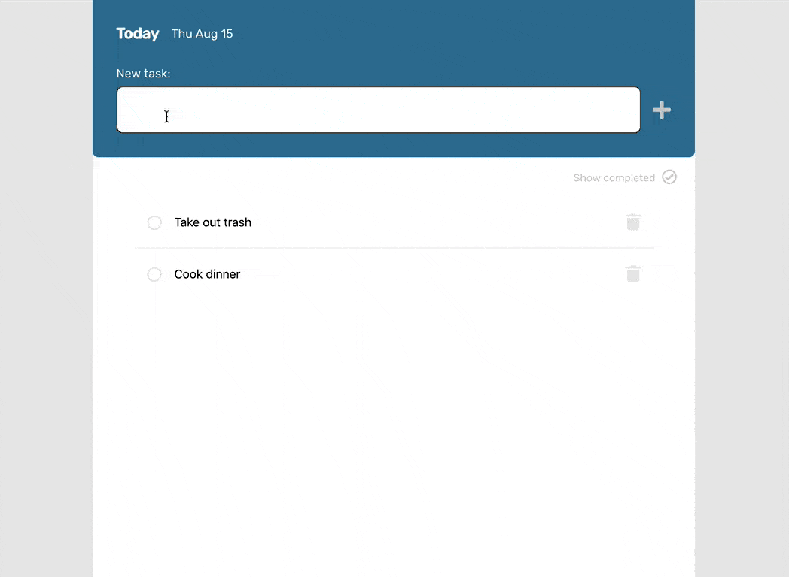

# React / Redux Todo App

A simple todo list application using React & Redux. Design / UX heavily inspired by [Todoist](https://todoist.com/) :heart:

### Get Started

`npm install` then:

- Run the app: `npm start`
- Run tests: `npm test`
- Run tests with coverage: `npm run test:coverage`
- Run linter `npm run lint`
